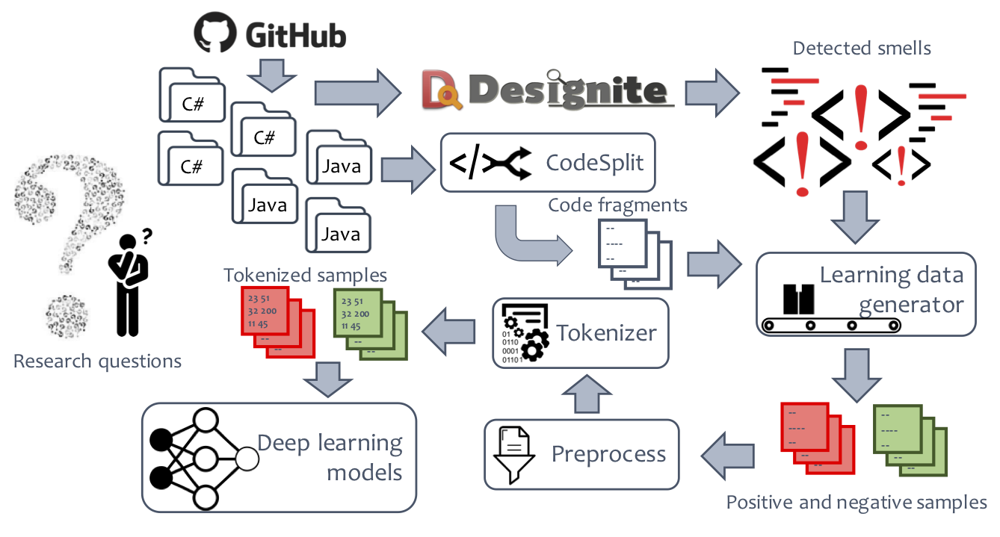

# Smelling smells using Deep Learning
We have two objectives to carry out this research.
The first objective is to explore the feasibility of applying deep learning models
to detect smells without extensive feature engineering,
just by feeding the source code elements in tokenized form.
Another goal of the work is to investigate the possibility of applying transfer-learning
in the context of deep learning models for smell detection by investigating transferability
of results between programming languages.

This repository contains supporting material of the experiment.

## Overview
The figure below provides an overview of the experiment.
We download 1,072 C# and 100 Java repositories
from GitHub.
We use Designite and DesigniteJava
to analyze C# and Java code respectively.
We use CodeSplit to extract each method and class definition into separate files
from C# and Java programs.
Then the learning data generator uses the detected smells to bifurcate code
fragments into positive or negative samples for a smell - positive samples contains the smell
while the negative samples are free from that smell.
We apply preprocessing operations on these samples such as removing duplicates
and feed the output to Tokenizer.
Tokenizer takes a method or class definition and generates integer tokens for each
token in the source code.
The output of Tokenizer is ready to feed to neural networks.

# What this repository contains
## Code
- Source code for data curation (analyzing source code and detect smells, split the code fragments (method and classes) into separate files, generating positive and negative samples using the detected smells, and tokenize them).
- Python implementation of our CNN and RNN architecture that we used to detect smells including reading data, preprocess, and passing them to the deep learning models.

## Data
- Detected smells data for both C# and Java
- Code fragments for both C# and Java
- Generated positive and negative samples for each considered code smell.
- Tokenized samples in one and two dimensions
